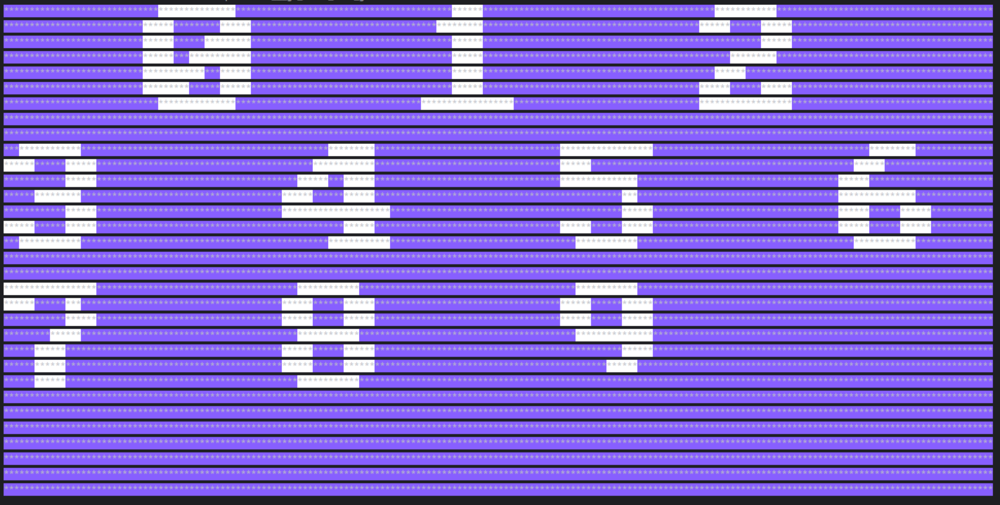

## Go_emu
Go lang risc-v 5 stage pipeline emulator with terminal based display.
It can to execute bare metal risc-v compiled rom and draw some pixels in terminal display.

##
The project is entirely academic, it does not aim to be competitive against complex implementations. 
The rationale behind it was basically learning about RISC-V, the ISA, Go language and processor design in general

## Demonstration

## Used resources
- https://riscv.org/wp-content/uploads/2017/05/riscv-spec-v2.2.pdf
- https://chipmunklogic.com/digital-logic-design/designing-pequeno-risc-v-cpu-from-scratch-part-3-dealing-with-pipeline-hazards/
- https://luplab.gitlab.io/rvcodecjs/
- https://ripes.me/
